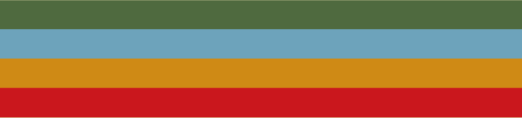

## i'm a novice programmer and future software engineer :-D
### i'm mostly focused on learning as much as i can right now, but i'm interested in low-level programming, game dev, and computer stuff in general!

i use these tools:
- VSCode
- MSYS2
- Love2D
- RPG Maker MZ
- GitHub Copilot (exclusively for learning and code review.)

i know a little bit of these languages:
- Lua
- Scratch (lmao)

and i'm learning some of these:
- Ruby
- C (mostly this)
